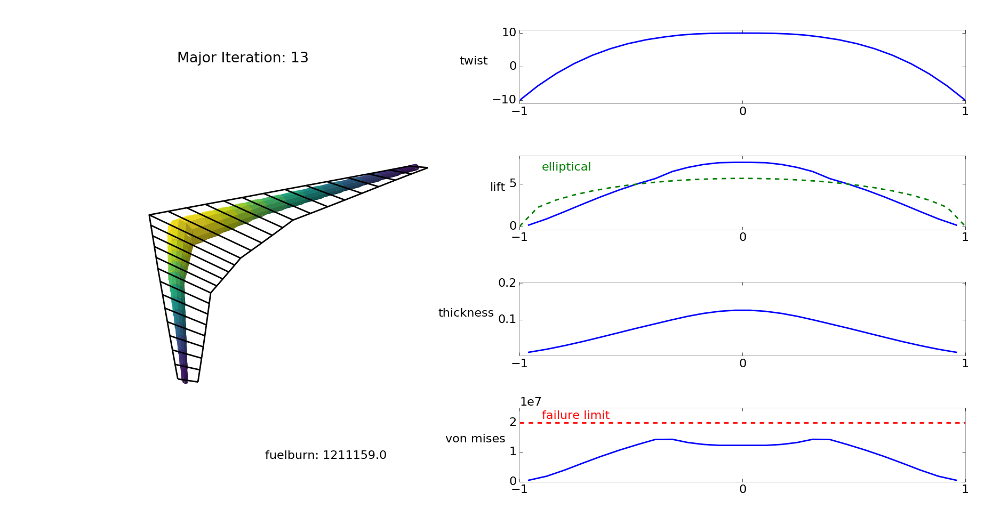

.. OpenAeroStruct documentation master file, created by
   sphinx-quickstart on Wed Jul 13 13:18:23 2016.
   You can adapt this file completely to your liking, but it should at least
   contain the root `toctree` directive.

OpenAeroStruct Documentation
==========================================

OpenAeroStruct is a lightweight tool to perform aerostructural optimization using OpenMDAO.
It couples a vortex-lattice method (VLM) and a 6 degrees of freedom 3-dimensional spatial beam model to simulate the aerodynamic and structural properties of lifting surfaces.
These simulations are wrapped in an optimizer using NASA's OpenMDAO framework.
The analysis and optimization results can be visualized using included tools, producing figures such as this:

Installation
-----------------

To use OpenAeroStruct, you must first install OpenMDAO 1.7.3 by following the instructions here: https://github.com/openmdao/openmdao. If you are unfamiliar with OpenMDAO and wish to modify the internals of OpenAeroStruct, you should examine the OpenMDAO documentation at http://openmdao.readthedocs.io/en/1.7.3/. The tutorials provided with OpenMDAO, especially The Sellar Problem, are helpful to understand the basics of using OpenMDAO to solve an optimization problem. Note that OpenMDAO 1.7.3 is the most recent version that has been tested and confirmed working with OpenAeroStruct.

Next, clone this repository:

.. code-block:: bash

    git clone https://github.com/johnjasa/OpenAeroStruct.git

Lastly, from within the OpenAeroStruct folder, make the Fortran files:

.. code-block:: bash

    make

Note that the code will run without compiling the Fortran library, but it will run significantly faster when using Fortran.

Usage
-----

`run_vlm.py` is for aero-only analysis and optimization. It can use a single lifting surface or multiple separate lifting surfaces.

`run_spatialbeam.py` is for structural-only analysis and optimization. It can use a single structural component or multiple structural components, where each component represents a spar within a lifting surface.

`run_aerostruct.py` performs aerostructural analysis and optimization.

For each case, you can view the optimization results using `plot_all.py`. Examine its docstring for keyword information.

An example workflow would be:

.. code-block:: bash

    python run_aerostruct.py 1
    python plot_all.py aerostruct.db

The first command performs aerostructural optimization and the second visualizes the optimization history.

The keywords used for each file are explained in their respective docstrings at the top of the file.

If you wish to examine the code in more depth, see `run_classes.py` and the methods it calls. These methods interface directly with OpenMDAO.

Notes
-----

This current version of the repository has grown past the previous Matlab implementation. If you are looking for a Matlab-capable version, please see https://github.com/samtx/OpenAeroStruct for the latest version.

Known Issues
------------

* The increase in accuracy of results when using a cosine-spaced mesh is not as great as it should be.
* Aerostructural optimization sometimes fails to converge for certain geometries. The example provided in `run_aerostruct.py` should converge. The structural and aerodynamic values must make sense together, e.g. the beam thickness and radius must be able to support the aerodynamic loads.

Tutorials and Indices
==================

.. toctree::
   :maxdepth: 2

   tutorials.rst

Check out the module index below to see the internal methods within each file and how they're used.

* :ref:`genindex`
* :ref:`modindex`
* :ref:`search`
