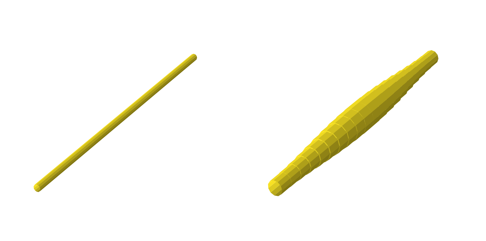
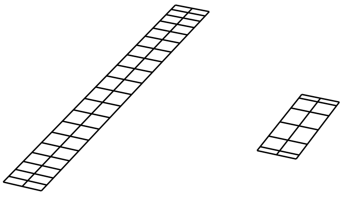

.. _Geometry Creation and Manipulation:

==================================
Geometry Creation and Manipulation
==================================

OpenAeroStruct contains two types of default surfaces: a simple rectangular lifting surface, and a wing modeled after a B777-type aircraft called the Common Research Model (CRM).
By default, `run_vlm.py` and `run_spatialbeam.py` both use the rectangular surface, while `run_aerostruct.py` uses the CRM surface, though any surface can be used for any type of analysis or optimization.

Using a user-defined mesh
-------------------------

Although there are two default surface types available, any mesh can be supplied to OpenAeroStruct.
The mesh array must be three-dimensional and of the shape `(num_x, num_y, 3)`, where
num_x is the number of chordwise nodal points, num_y is the number of spanwise nodal points,
and the last dimension contains the x, y, z coordinates of the point in space.

Looping through the three-dimensional array, we could print the individual coordinate
points for each node of the mesh using the following code:

.. code-block:: python

  for j in range(num_x):
      for i in range(num_y):
          print(mesh[j, i, :])

The figure below shows how the nodes are indexed for each dimension corresponding to the above code.

.. image:: mesh-diagram.svg
  :width: 75 %
  :align: center

Here is a short example using a user-supplied mesh:

.. code-block:: python

  import numpy as np
  from OpenAeroStruct import OASProblem

  # Set problem type
  prob_dict = {'type' : 'aero',
               'optimize' : False}

  nx = 2  # number of chordwise nodal points
  ny2 = 21  # number of spanwise nodal points for the half-span
  span = 10.
  root_chord = 1.

  # Initialize the mesh object. Note that the three dimensions of the array
  # go in order of chordwise, spanwise, then the 3D coordinates.
  mesh = np.zeros((nx, ny2, 3))

  # Set up a basic rectangular wing with the given span and root chord.
  # Note we only model one half of the wing.
  # We start away from the symmetry plane and approach the plane as the array
  # indices increase.
  mesh[:, :, 1] = np.linspace(-span/2, 0, ny2)
  mesh[1, :, 0] = root_chord

  # Now we vary the z coordinate of the wing linearly in two sections to create
  # an inverted gull wing shape.

  # The wingtip is translated upwards while the 1/3 span is translated downwards.
  mesh[:, :2*ny2//3, 2] += np.linspace(.5, -.25, 2*ny2//3)
  mesh[:, 2*ny2//3:, 2] -= np.linspace(.25, 0, ny2 - 2*ny2//3)

  # Instantiate problem and add default surface
  OAS_prob = OASProblem(prob_dict)
  OAS_prob.add_surface({'name' : 'wing',
                        'symmetry' : True,
                        'mesh' : mesh})

  # Set up and run the problem
  OAS_prob.setup()
  OAS_prob.run()

This produces the inverted gull-wing shown below:

.. image:: inverted_gull-wing.svg
  :width: 75 %
  :align: center

|

.. note::
  When using `symmetry = True` for the surface, only define half of the mesh. Otherwise, define the entire mesh.

Using OpenAeroStruct's geometry modifiers to create an initial geometry
-----------------------------------------------------------------------

Instead of using a user-defined mesh, you could start with the default rectangular mesh and transform it into a certain shape using OpenAeroStruct's geometry tools.
In the code below, we start with a rectangular wing and apply a chord and x shear distribution to create a wing shape close to the CRM.

.. note::
  We can use any number of control points for each design variable to achieve our desired shape.
  The number of control points does not need to match the number of nodal points.

.. code-block:: python

    import numpy as np
    from OpenAeroStruct import OASProblem

    # Set problem type and name
    prob_dict = {'prob_name' : 'CRM_geom',
                'type' : 'aerostruct',
                'optimize' : False,
                }

    # Instantiate problem and add default surface
    OAS_prob = OASProblem(prob_dict)

    # Create a dictionary to store options about the surface
    surf_dict = {
                 'symmetry' : True,
                 'num_y' : 7,  # set total number of spanwise nodes
                 'num_x' : 2,  # set number of chordwise nodes
                 'wing_type' : 'rect',  # begin with rectangular wing
                 'span' : 58.,  # set full span
                 'root_chord' : 5.,  # set the root chord
                 'chord_cp' : np.array([0.5, 0.9, 1.2, 2.7]),  # set chord control point distribution
                 'span_cos_spacing' : 0.5,  # set spanwise spacing
                 'xshear_cp' : np.array([19., 16, 7, 0.]),  # set x shear control point distribution
                 'CL0' : 0.2,  # CL at AoA = 0
                 'CD0' : 0.015,  # CD at AoA = 0
                 }

    # Add the specified wing surface to the problem
    OAS_prob.add_surface(surf_dict)
    OAS_prob.setup()

    # Actually run the problem
    OAS_prob.run()

This produces the wing shown below.

|

.. image:: CRM_esque.svg
  :width: 60 %
  :align: center

|

Explanation of design variables
-------------------------------

We currently have eight design variables, which we will detail below. Sweep, taper, and dihedral each have one design variable defined for a single lifting surface, while twist, chord, xshear, zshear, thickness, and radius are arrays that contain values for specific spanwise locations along the surface.

Instead of directly controlling the nodal mesh points for the design variables defined as arrays along the span, we use vary b-spline control points which influence a b-spline interpolation.
For example, in the figure below, we control the green points as our design variables, which are the b-spline knots.
The blue curve is interpolated from the green points and the blue curve is what would modify the aerodynamic mesh.
In this way we can choose the number of design variables independently of the fidelity of the aerodynamic mesh.

.. image:: bspline.svg

In each of the images below, the left wing is the initial rectangular wing and the right wing is the perturbed wing based on the specific design variable.

Angle of attack
~~~~~~~~~~~~~~~
Angle of attack, or alpha, does not change the geometry of the lifting surface at all.
Instead, it changes the incidence angle of the incoming flow.
This affects the right-hand-side of the linear system that we solve to obtain the aerodynamic circulations.

Taper
~~~~~

The taper design variable is the taper ratio of the wing which linearly varies the chord of the wing.
A value of 1.0 corresponds to a straight rectangular wing, whereas a value less than 1 corresponds to a tapered wing.
Values greater than 1 are possible.

.. image:: taper.svg

Sweep
~~~~~

The sweep design variable performs shearing sweep in which the planform area and the y-coordinate extents remain constant.
Positive angles sweep back.

.. image:: sweep.svg

Dihedral
~~~~~~~~

Positive dihedral rotates the wing such that the tip is higher than the root.
As with taper and sweep, this linearly varies across the span.

.. image:: dihedral.svg

Chord
~~~~~

Whereas taper ratio can only vary the chord linearly across the span, the chord design variable allows for arbitrary chord distributions, as shown below.

.. image:: chord.svg

X Shear
~~~~~~~

This design variable changes the x-coordinate at each certain spanwise location, as shown below.
It can be any arbitrary distribution.
This is a more general form of the sweep variable.

.. image:: xshear.svg

Z Shear
~~~~~~~

This design variable changes the z-coordinate at each certain spanwise location, as shown below.
It can be any arbitrary distribution.
This is a more general form of the dihedral variable.

.. image:: zshear.svg

Twist
~~~~~

Below we show a wing with linear twist variation along the span.
OpenAeroStruct is capable of arbitrary twist distributions.

.. image:: twist.svg

Thickness
~~~~~~~~~

Control the thickness of the structural spar; can have any distribution.
The thickness is added internally to the tubular spar, so we must impose a non-intersection
constraint when optimizing that limits the thickness so it does not go past the physical boundary
of a solid cylinder.
Here we can't reliably see thickness changes, so the color of the spar corresponds to thickness.

.. image:: thickness.svg

Radius
~~~~~~

Control the radius of the structural spar; can have any distribution.
With an aerostructural case, it would make physical sense to have some limit on the radius such
that the spar is not larger than the thickness of the airfoil.
You can set this manually when you set the design variable or you can use the experimental
`SparWithinWing` component.

Multiple lifting surfaces
-------------------------

So far we have only discussed cases with a single lifting surface, though OpenAeroStruct can handle multiple surfaces.
For example, you could have a case with a main wing surface and a tail surface as shown below.

Most components operate only on one lifting surface without regard for the others in the problem.
Only two components need to have information from all lifting surfaces -- `AssembleAIC` and `VLMForces`.
`AssembleAIC` considers all lifting surfaces when it constructs the aerodynamic influence coefficient (AIC) matrix.
