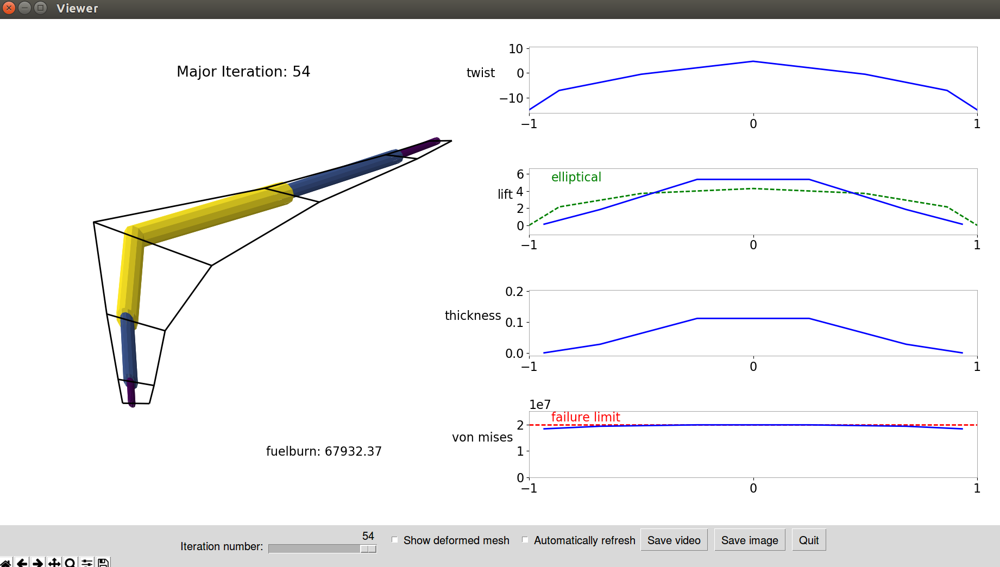
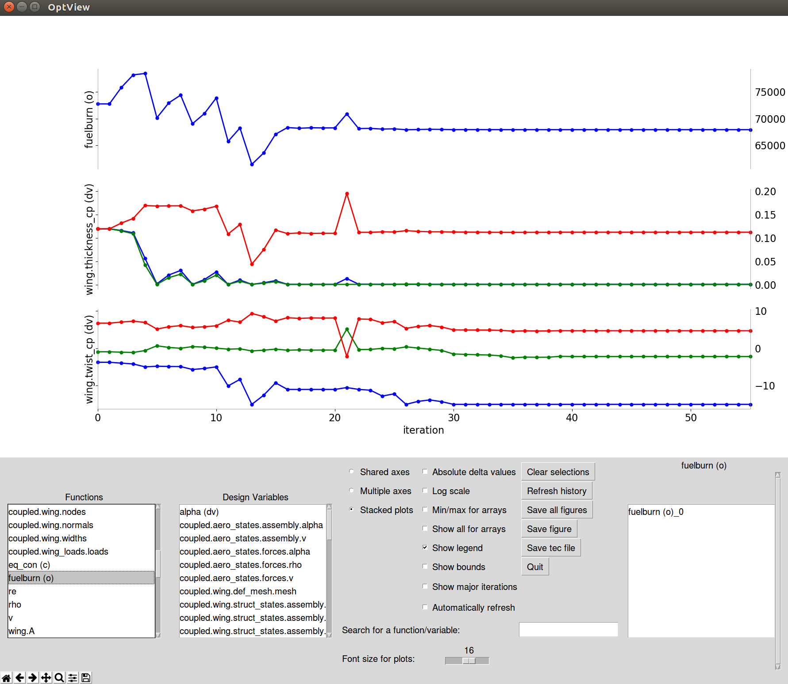

.. _Problem Setup:

=============
Problem Setup
=============

This page serves as a simple introduction to the internal code of OpenAeroStruct and how it is organized.
Not every feature is explained here, so please contact the authors if you have a suggestion for how to make something more clear.

In general, you'll follow these five steps to set up and run a problem in OpenAeroStruct:

1. Initialize your problem
2. Add your lifting surface(s)
3. Add your design variables, constraints, and objective
4. Call setup() on the problem
5. Call run() to perform analysis or optimization

We'll now investigate these steps individually, using an aerodynamic optimization case as an example.

1. Initialize your problem
--------------------------
First, you will initialize the OpenAeroStruct problem by creating an `OASProblem` instance
with an input dictionary containing the problem-level settings you wish to use.
This includes flow conditions such as Reynolds number and angle of attack,
as well as aircraft info like specific fuel consumption and range.
Additionally, it contains execution options for the problem, such as
whether to run analysis or optimization and how to compute derivatives.
Please see :func:`OASProblem.get_default_prob_dict`  to see the defaults for the problem options dictionary.

Here is a sample code block for this step:

.. code-block:: python

  from __future__ import print_function
  from OpenAeroStruct import OASProblem

  # Set problem type and instantiate problem
  prob_dict = {'type' : 'aero',
               'optimize' : True}
  OAS_prob = OASProblem(prob_dict)

Although some options are only used for aerostructural cases, each problem always
has every option defined.
The user-specified options overwrite any of the default options.
Keywords are case-specific.

.. note::
  Depending on your problem size, using `force_fd = True` might lower
  the computation time for your optimization compared to using the semi-analytic
  method that is the default. This option simply computes
  the total derivatives by finite-differencing over the entire model.

If you install `pyOptSparse <https://bitbucket.org/mdolab/pyoptsparse>`_, you can use `pyOptSparseDriver` within OpenMDAO.
This allows you to use a wider variety of optimizers.
However, this is only recommended for Linux and Mac users, as the relevant
portions of pyOptSparse may be difficult to compile correctly on some Windows machines.

2. Add your lifting surface(s)
------------------------------
With your OASProblem instance created, you can now define surfaces and add them to the problem.
In the simplest case, you can add a single lifting surface that represents the wing of an aircraft.
Please see :func:`OASProblem.get_default_surf_dict` to see the defaults for the surface options dictionary.

There are many options for each surface, and they are loosely organized into the following categories:

- Wing definition (mesh size, wing position, symmetry option, etc)
- Geometric variable definitions (span, dihedral, sweep, twist, etc)
- Aerodynamic performance (CL and CD at angle of attack=0)
- Airfoil properties (turbulence transition point, t/c, location of max t)
- Structural properties (E, G, yield stress, location of spar, etc)
- Options for constraints (KS aggregation, monotonic design variables)

Again, the user-specified dictionary will override any defaults.
Here is a sample code block:

.. code-block:: python

  # Add lifting surface
  surf_dict = {'name' : 'wing',
               'symmetry' : True,
               'num_y' : 11,
               'num_x' : 3}
  OAS_prob.add_surface(surf_dict)

3. Add your design variables, constraints, and objective
--------------------------------------------------------
.. note::
  This step is only necessary when performing an optimization, with
  `optimize = True` in the problem dictionary.

With the problem and surfaces defined, we can now add a description of the
optimization problem.
The order of these commands does not matter.
These OpenAeroStruct methods simply call the OpenMDAO methods that are documented here: http://openmdao.readthedocs.io/en/latest/srcdocs/packages/core/driver.html

You can choose a certain set of parameters as design variables, including:

- angle of attack
- taper
- span
- dihedral
- sweep
- chord distribution
- twist distribution
- shear deformation in x direction
- shear deformation in y direction
- structural spar radius distribution
- structural spar thickness distribution

For the constraints and objective, you can choose any outputted variable.
Common constraints include:

- structural failure
- CL = fixed value
- monotonic constraint on spanwise variable (e.g. chord can only get decrease as you go outboard)

Common objectives include:

- weight
- fuel burn
- CL
- CD

Sample code block:

.. code-block:: python

  # Add design variables, constraint, and objective and setup problem
  OAS_prob.add_design_var('wing.twist_cp', lower=-10., upper=15.)
  OAS_prob.add_constraint('wing_perf.CL', equals=0.5)
  OAS_prob.add_objective('wing_perf.CD', scaler=1e4)

4. Call setup() on the problem
------------------------------

.. code-block:: python

  OAS_prob.setup()

Depending on the user-defined problem type, this setup function calls
:func:`OASProblem.setup_aero`,
:func:`OASProblem.setup_struct`, or
:func:`OASProblem.setup_aerostruct`.
Each of these methods is different, but they mainly organize the OpenMDAO
components for each of the disciplines in the correct manner and then
set up the OpenMDAO problem.

For aero-only, that means that the lifitng surfaces are added and linked together
so we can compute the entire AIC matrix.
For struct-only, we can set up each spar individually because they have no effect
on each other.
For aerostructural cases, we must take care to add the aerodynamic and structural
components in the correct groups within the problem.
The mesh setup and performance components are outside the coupled group, whereas
the FEM and VLM solvers are within the coupled group so we can converge
the coupled aerostructural system.

We'll now take a moment to explain the organization of the coupled aerostructural system.
See the image below for a simplified :math:`N^2` diagram of the default aerostructural problem.

.. image:: collapsed_aerostruct_diagram.png

We have four groups and two individual components on the root level:

- `prob_vars` contains problem-level parameters such as Mach number, angle of attack, etc
- `wing` contains geometric information describing the wing surface
- `coupled` contains the aerodynamic and structural analyses in a multidisciplinary analysis (MDA) group
- `wing_perf` evaluates the aerodynamic and structural performance of the wing surface
- `fuelburn` and `eq_con` evaluate the fuel burn and :math:`L = W` constraint respectively

By default, we converge the MDA within the coupled group using Gauss-Seidel fixed-point iterations.
Note that the loads from the structural analysis get passed back to the wing mesh.
We then use this deformed wing mesh within the VLM analysis to obtain the new aerodynamic properties.
We iterate until the coupling variables do not change.

You can set the linear and non-linear solvers to see what works best for specific problems.

5. Call run() to perform analysis or optimization
-------------------------------------------------

Lastly, we call :func:`OASProblem.run` to finalize OpenMDAO setup and actually run the problem.
If `optimize = False` in the problem dictionary, then we perform analysis on the initial geometry.
If `optimize = True`, then we run optimization with the given formulation and optimizer selected.
The outputted results of the analysis or optimization are available after running by accessing
the variables as shown below:

.. code-block:: python

  # Actually run the problem
  OAS_prob.run()

  print("\nWing CL:", OAS_prob.prob['wing_perf.CL'])
  print("Wing CD:", OAS_prob.prob['wing_perf.CD'])

Within this method, OpenAeroStruct gives the design variables, constraints, and objective to the OpenMDAO problem.
We also tell OpenMDAO that we want the optimization history saved in a `.db` file and that we want the problem layout saved in an `.html` file.
After running an analysis or optimization, you can view these outputted files.

Use any web browser to open the `.html` file and you can examine your problem layout.
Mouse over components and parameters to see the data-passing connections between them.
The `.html` file also has a help button (the ? mark) on the far right of the top toolbar with information about more features.

You can visualize the lifting surface and structural spar using:

.. code-block:: console

  python plot_all.py aerostruct.db

Here you'll use `aero.db`, `struct.db`, or `aerostruct.db` depending on what type of problem you ran.
This will produce a window where you can see how the lifting surface and design variables change with each iteration, as shown below.

You can also use `OptView.py` to see how the design variables, constraints,
and objective change throughout the optimization.
You can select what parameters you want to view and plot them in a few different formats.

You can monitor the results from your optimization in real-time with both `plot_all.py` and `OptView.py`.
Simply check the `Automatically refresh` button and the visualization will update with each optimization iteration.
