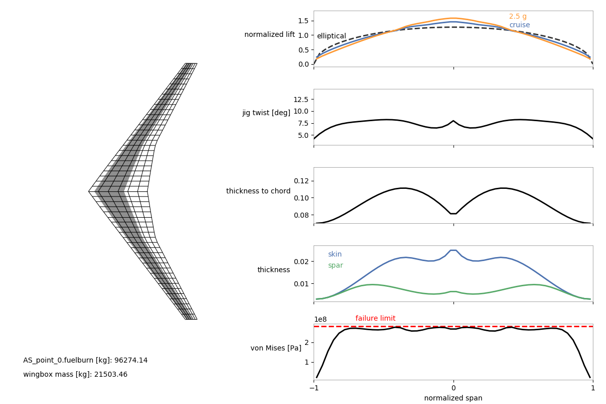
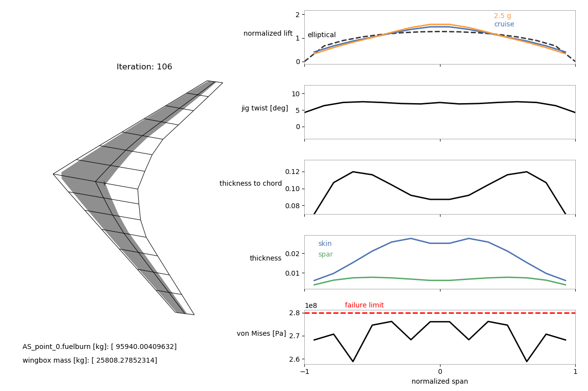

.. _Aerostructural_with_Wingbox_Walkthrough:

Aerostructural with Wingbox Walkthrough
=======================================

In addition to the tubular-spar structural model available in OpenAeroStruct, you can use a wingbox-based model.
This model is described in Chauhan and Martins' paper `here <https://www.researchgate.net/publication/327654423_Low-Fidelity_Aerostructural_Optimization_of_Aircraft_Wings_with_a_Simplified_Wingbox_Model_Using_OpenAeroStruct>`_.
We strongly recommend reading this relatively short conference paper to learn about the model and see some example results.
The presentation slides for this conference paper can be found `online <https://www.researchgate.net/publication/327802989_Presentation_slides_for_Low-fidelity_Aerostructural_Optimization_of_Aircraft_Wings_with_a_Simplified_Wingbox_Model_Using_OpenAeroStruct>`_.
Analytic derivatives are not provided for some components of this model, so any optimization problem will use the complex-step approximation to obtain the relevant partial derivatives for these components.

This page breaks down and describes an example optimization run-script that uses the wingbox model.
This example uses the same optimization problem used for the paper linked above, but with fewer design variables and a coarser mesh.
The wing being optimized is based on the undeflected Common Research Model (uCRM), which is a long-range transport aircraft.
A script to replicate the optimization problems described in the paper can be found in the examples directory (openaerostruct/examples/run_aerostruct_uCRM_multipoint.py).
Please contact Shamsheer Chauhan (sschau@umich.edu) with any questions you have after reading the above paper and going through this example.

The goal of the wingbox model is to allow more realistic preliminary structural sizing for commuter to long-range transport-type aircraft which typically have wingbox structures.
Since more realistic sizing is one of the goals of the wingbox model, this example also shows how to use it with a multipoint optimization.
Wing structures are usually sized using loads that do not occur during normal cruise conditions, so we must consider at least one more flight point that provides more extreme loads.

This tutorial assumes that the reader has gone through the other examples and tutorials in the OpenAeroStruct documentation and is now familiar with how to set up problems and the terminology of OpenAeroStruct.

Let's begin and look at the run-script now. First we import some modules.

.. literalinclude:: wingbox_mpt_opt_example.py
   :start-after: checkpoint 0
   :end-before: checkpoint 1

Next, we provide some airfoil coordinates.
These coordinates are used to define the shape of the wingbox cross-section.
In this example, we use the NASA SC2-0612 coordinates from airfoiltools.com.
However, here we only provide the coordinates for the 10%- to 60%-chord portion of the airfoil because for this example we assume that it is this portion of the chord along the wing that will be structural and form the wingbox.
Make sure that the first and last x-coordinates (chordwise) of the upper and lower curves are the same.
Also make sure that the chord length of the original airfoil has been normalized to 1 (this is normally the case for the airfoil coordinates available on airfoiltools.com).

These coordinates will be scaled based on the effective chord and thickness-to-chord ratio for each wingbox segment along the wing.
However, we currently have not implemented the functionality to specify different airfoil coordinates for different segments of the wing, so the same coordinates are used for the entire wing.

.. literalinclude:: wingbox_mpt_opt_example.py
  :start-after: checkpoint 1
  :end-before: checkpoint 2

Next, we create the dictionary with information for the mesh and create the mesh.
For this example we use the uCRM-based geometry (undeflected Common Research Model) already defined and available in OpenAeroStruct.
Alternatively, the user can provide their own mesh (see :ref:`Aerostructural_with_wingbox_(Q400)` for another example with a custom mesh).
Here we specify 15 as the number of spanwise nodes and 3 as the number of chordwise nodes for the VLM mesh.
We also set `chord_cos_spacing` and `span_cos_spacing` to `0` for uniform panel spacing.
The FEM model will use the spanwise spacing of the VLM mesh for the FEM mesh.
We use a very coarse mesh for this example to keep the computational time low.

The `generate_mesh` function takes the inputs from the mesh dictionary and returns the mesh as well as values for the B-spline control points for the twist distribution (we specify the number of control points for this using `num_twist_cp` in the dictionary).
Note that in this example we don't end up using this twist distribution, but instead use a better starting twist distribution which will be seen later.

.. literalinclude:: wingbox_mpt_opt_example.py
  :start-after: checkpoint 2
  :end-before: checkpoint 3

Next, we create a surface dictionary and provide necessary information for our lifting surface.
After providing the relevant information for the `name`, `symmetry`, and `S_ref_type` settings, we provide the mesh and specify the string `'wingbox'` for the `fem_model_type` (if we wanted the tubular structure, we would specify `'tube'` instead).
We also provide the airfoil coordinates for the wingbox cross-section here as the four arrays defined earlier.

.. literalinclude:: wingbox_mpt_opt_example.py
  :start-after: checkpoint 3
  :end-before: checkpoint 4

Next, we provide some initial values for the wingbox spar and skin thickness distributions (B-spline control points), along with the wing twist distribution (note that these distributions do not need to have the same number of control points).
For the wingbox model, to maintain simplicity, we use the same thickness variables for both the top and bottom wing skins.
Similarly, we use the same thickness variables for the front and rear spars.
Currently, we do not model buckling or have any buckling constraints.
However, a comparison of optimized skin thicknesses with high-fidelity results shown in these `slides <https://www.researchgate.net/publication/327802989_Presentation_slides_for_Low-fidelity_Aerostructural_Optimization_of_Aircraft_Wings_with_a_Simplified_Wingbox_Model_Using_OpenAeroStruct>`_, indicates that, assuming the wing has a reasonable rib spacing, this is not a very major concern.

We also provide a distribution for the thickness-to-chord ratio (B-spline control points for `t_over_c_cp`).
The thickness-to-chord ratio design variable is important for the trade-off between aerodynamic (wave and viscous drag) benefits from a thin wing and structural benefits from a thick wing.
The `original_wingbox_airfoil_t_over_c` is the thickness-to-chord ratio of the airfoil provided for the wingbox cross-section.
For this example, the thickness-to-chord ratio of the SC2-0612 is 12%.
This is used to scale the airfoil in the thickness direction as the thickness-to-chord ratio variable changes.
Note that the thickness-to-chord ratio variable is the streamwise value.
Using the sweep angle for the wingbox elements OpenAeroStruct computes the effective values for the wingbox cross-sections normal to the elements.

.. literalinclude:: wingbox_mpt_opt_example.py
  :start-after: checkpoint 4
  :end-before: checkpoint 5

Next, we provide some information related to aerodynamics and specify some options.
We set `CDO` to 0.0078 to account for the drag from the fuselage, tail surfaces, nacelles, and pylons (which are not being modeled).
We set `with_viscous` to `True` to make OpenAeroStruct include an estimate for viscous drag (empirical equations) when computing the drag of the wing.
We set `with_wave` to `True` to make OpenAeroStruct also include an estimate for wave drag using the empirical equations based on the Korn equation.
This wave drag estimate needs a thickness-to-chord ratio value and a sweep angle value for the wing.
This is computed internally by averaging the thickness-to-chord ratios and sweep angles across the span of the wing weighted by the widths of the corresponding VLM panels.
Keep this in mind when creating wing meshes and setting up optimization problems using the wingbox model.
The optimizer may try to take advantage of this averaging.

The `k_lam` value is the fraction of the chord assumed to have laminar flow, and is used for OpenAeroStruct's viscous drag estimates (empirical equations).
The `c_max_t` value is the location of the maximum thickness of the airfoil along the chord, and is also used for OpenAeroStruct's viscous drag estimates.

.. literalinclude:: wingbox_mpt_opt_example.py
  :start-after: checkpoint 5
  :end-before: checkpoint 6

Next we provide some information related to structures.
We provide the Young's and shear moduli, as well as the allowable yield stress and density of the material being used (the wingbox model currently assumes that the material is isotropic).
Here we use include a safety factor of 1.5 in the allowable yield stress.
The `strength_factor_for_upper_skin` value can be used to adjust the yield strength of the upper skin relative to the lower skin.
For example, if we were using different alloys for the top and bottom skin (e.g., Al7075 vs Al2024) we would provide the allowable yield stress of the lower skin for `yield` and the ratio of the yield strengths of the upper skin to the lower skin for `strength_factor_for_upper_skin`.
The `wing_weight_ratio` number is used to estimate the weight of other components not modeled in the wingbox structure (e.g., overlaps, fasteners, etc.).
With the `exact_failure_constraint` set to `False`, we aggregate the stress constraints for the FEM elements into a single constraint using the  Kreisselmeier--Steinhauser function.
This helps reduce computational cost during optimization by replacing a large number of constraints (one for each stress combination for each element) with a single constraint.

.. literalinclude:: wingbox_mpt_opt_example.py
  :start-after: checkpoint 6
  :end-before: checkpoint 7

The next two options `struct_weight_relief` and `distributed_fuel_weight` are used to specify whether the user wants the loads from the weight of the wingbox structure and the weight of the fuel to be distributed on the wing structure to provide load relief.
The `struct_weight_relief` is for the loads from the weight of the structure (including the `wing_weight_ratio` factor).
The `distributed_fuel_weight` is for the loads from the weight of the fuel, which is assumed to be distributed across the entire wing (the fraction of the total fuel that each wingbox segment, corresponding to each finite element, holds is equal to the ratio of its enclosed volume to the total enclosed volume of all the wingbox segments).
We can also use the option `n_point_masses` if we want to add loads from point masses on to the wing structure (e.g., for engines).
Here we set `n_point_masses` to 1 because we have one engine on each side of the aircraft (recall that we are using symmetry).
If we did not want to add point masses, we would omit this option (do not set it to 0).

.. literalinclude:: wingbox_mpt_opt_example.py
  :start-after: checkpoint 7
  :end-before: checkpoint 8

Next, we specify the density of the fuel (used to compute fuel volume from fuel mass) and also specify how much fuel we are carrying as reserves.
This reserve fuel weight is added to the weight of the aircraft for performance calculations as well as computing the loads from the fuel on the wing when using the `distributed_fuel_weight` option.
With these two final options, we are done with the surface dictionary and add it to a list called surfaces (here we only have one surface, but in general we might have multiple).

.. literalinclude:: wingbox_mpt_opt_example.py
  :start-after: checkpoint 8
  :end-before: checkpoint 9

Next, we instantiate the OpenMDAO `Problem` and specify the independent variables.
We will use some of these variables later as design variables and some simply as inputs.
First we provide some inputs related to the flight conditions (Mach number, airspeed, Reynolds number per unit length, air density, and speed of sound).
Since we want to consider two flight points in this example (a nominal cruise case and a 2.5g maneuver case), we provide two values for each input that is different for the two cases.
For example, our cruise Mach number is 0.85 and our maneuver Mach number is 0.64.

.. literalinclude:: wingbox_mpt_opt_example.py
  :start-after: checkpoint 9
  :end-before: checkpoint 10

The following are some more independent variables.
We have the thrust-specific fuel consumption, `CT`, cruise range, `R`, and the weight of the aircraft without the fuel required for the cruise point and without the weight of the wing structure and point masses, `W0_without_point_masses`.
Since we are not interested in the fuel burn or range at the maneuver point, we only provide a single value for these inputs that will be used for the cruise fuel burn.
Note that `W0_without_point_masses` includes the reserve fuel weight, which is why it is added here.

.. literalinclude:: wingbox_mpt_opt_example.py
  :start-after: checkpoint 10
  :end-before: checkpoint 11

Next, we specify the load factor for each flight point (1g for cruise and 2.5g for the maneuver case).
We also provide values for the angle of attack.
In this case, instead of providing two values as an array for one variable, we add two separate variables with different names (`alpha` and `alpha_maneuver`).
We create two variables just for convenience because, for this example, we allow the optimizer to trim the aircraft for the maneuver case using the angle of attack for that flight point (by making it a design variable), but keep the angle of attack fixed for the cruise case and make the optimizer trim the aircraft for the cruise flight point using the twist distribution.
We also include the empty center of gravity location here as a reminder that we could use it later for studies in which we include tail surfaces and consider pitching moments (not done in this example).

.. literalinclude:: wingbox_mpt_opt_example.py
  :start-after: checkpoint 11
  :end-before: checkpoint 12

Finally, we also add the fuel mass as an independent variable to use it as a design variable.
This may seem like a strange design variable to have, but we do this from an optimization architecture point of view.
Instead of directly transferring the fuel burn value from the cruise point to the maneuver point (used to calculate MTOW for the maneuver point), we instead create a constraint (shown later) and make the optimizer ensure that the value being used for the fuel mass is the same value that is computed in the cruise point.
This also allows the flexibility to later decide that you want to use a different value for the fuel mass for the maneuver case (or any other flight point you may have) that does not depend on the cruise point (or any other flight point you may have).

.. literalinclude:: wingbox_mpt_opt_example.py
  :start-after: checkpoint 12
  :end-before: checkpoint 12.5

Next, we include the engine mass magnitude and locations in the problem.
OpenAeroStruct can handle any generic point masses add to the structural system.
In this case, we're adding the engine mass, which is set to 10,000 kg, to an appropriate location in front of the wing.
The `point_mass_locations` coordinates are in the global frame.
The loads caused by the point masses are transferred to the structural nodes based on the nodes' proximity to the point masses (using an inverse-distance approach).
We then compute the actual `W0` value by summing the `point_masses` and `W0_without_point_masses`.
Thus, the `W0` value used in subsequent components includes the point masses, reserve fuel weight, and all weights of the aircraft except the wing structural mass and computed fuel burn.
We add `point_masses` and `point_mass_locations` using `indep_var_comp` so that they can be changed during optimization (although they are not in this example).

.. literalinclude:: wingbox_mpt_opt_example.py
  :start-after: checkpoint 12.5
  :end-before: checkpoint 13

Next, we instantiate aerostructual `groups` for each surface (only one in this example) and add them to the model.
We use a loop for generality but it is not necessary for this example because we only have one surface (just the wing).

.. literalinclude:: wingbox_mpt_opt_example.py
  :start-after: checkpoint 13
  :end-before: checkpoint 14

Now we have to instantiate aerostructural flight points (one for cruise and one for the maneuver case in this example), add them to the model, and after that connect the inputs to the points.

.. literalinclude:: wingbox_mpt_opt_example.py
  :start-after: checkpoint 14
  :end-before: checkpoint 15

Here we make connect the inputs to the flight points.
For the inputs that have different values for each flight point, we also specify the `src_indices` to specify which one of the input values to use.
In some connections you may notice slightly different naming.
For example, for the air density we write `'rho', point_name + '.rho'`, but for the fuel mass we write `'fuel_mass', point_name + '.total_perf.L_equals_W.fuelburn'`.
This has to do with how the variables belonging to different components and groups have been promoted (i.e., which level in the hierarchy they are available at).
If you are unsure about where variables have been promoted to, while making connections on your own later, use OpenMDAO's feature for visualizing the N2 diagram (commands shown later).
Hovering over variables in this diagram should tell you what names to use for them.

.. literalinclude:: wingbox_mpt_opt_example.py
  :start-after: checkpoint 15
  :end-before: checkpoint 16

Now we have to make a few more internal connections that are not made automatically.
Once again, if you are unsure about whether variables have been connected correctly, use OpenMDAO's N2 diagram visualization feature (commands shown later).
That diagram should show the connections, and the variables that have not been connected will be highlighted in red.

.. literalinclude:: wingbox_mpt_opt_example.py
  :start-after: checkpoint 16
  :end-before: checkpoint 17

We have a couple more connections to make outside the loop because of the variable naming.

.. literalinclude:: wingbox_mpt_opt_example.py
  :start-after: checkpoint 17
  :end-before: checkpoint 18

For this example, we are also interested in adding a fuel-volume constraint that makes sure that the wingbox has enough internal volume to store the required fuel mass (estimated from the cruise flight point plus the reserve fuel).
First we instantiate and add the component that computes the difference between the available internal volume and the required fuel volume (`WingboxFuelVolDelta`).
Then we make some connections.
We connect the fuel burn computed from the cruise condition to this component because we are interested in the fuel burn value from the cruise condition.
We also have an `if` statement to make some more connections if we want the loads from the weight of the fuel to be applied to the FEM model.

.. literalinclude:: wingbox_mpt_opt_example.py
  :start-after: checkpoint 18
  :end-before: checkpoint 19

Next, we use OpenMDAO's ExecComp feature (which can be used to quickly create simple components) to create a component that is used later for the constraint that ensures that the fuel mass value (used to compute the aircraft weight and fuel loads) is the same as the fuel burn mass computed from the cruise point (i.e., AS_point_0 here).

.. literalinclude:: wingbox_mpt_opt_example.py
  :start-after: checkpoint 19
  :end-before: checkpoint 20

Now it is time to specify the objective function and design variables.
For this example, the objective function is the fuel burn computed using the cruise point (AS_point_0).
The design variables are the control points for the twist, spar thickness, skin thickness, and thickness-to-chord ratio distributions.
We add these design variables along with upper and lower bounds, and scalers.
The scalers are used to scale the values of the design variables to help the optimizer converge better.
Usually a scaler that brings the design variable to an order of magnitude around 1 is recommended.
We also have a design variable for the maneuver angle of attack.
In this example, the cruise angle of attack (which rotates the entire wing) is fixed at 0 and the optimizer uses the twist distribution to trim the aircraft for cruise.
Then using this same twist distribution, the maneuver case is trimmed using the maneuver angle of attack design variable.

.. literalinclude:: wingbox_mpt_opt_example.py
  :start-after: checkpoint 20
  :end-before: checkpoint 21

Next we add some constraints.
For the cruise point, we specify a nominal coefficient of lift of 0.5.

.. literalinclude:: wingbox_mpt_opt_example.py
  :start-after: checkpoint 21
  :end-before: checkpoint 22

For the maneuver point, we use the following constraints to ensure that the lift equals the weight, and that the stresses in the structure do not exceed the specified allowable value.

.. literalinclude:: wingbox_mpt_opt_example.py
  :start-after: checkpoint 22
  :end-before: checkpoint 23

For this example, we also add a constraint that ensures that the wingbox has enough internal volume for the fuel.

.. literalinclude:: wingbox_mpt_opt_example.py
  :start-after: checkpoint 23
  :end-before: checkpoint 24

Now we add `fuel_mass` as a design variable and add the consistency constraint that ensures that the fuel mass value is the same as the fuel burn mass computed from the cruise point.

.. literalinclude:: wingbox_mpt_opt_example.py
  :start-after: checkpoint 24
  :end-before: checkpoint 25

Next, we specify an optimizer and its tolerance.
Here we use the easily available SLSQP optimizer from SciPy and specify a very low tolerance to keep the computational cost very low for the purposes of this example.
We recommend that the user experiments with tolerances and uses much tighter tolerances for their studies.

.. literalinclude:: wingbox_mpt_opt_example.py
  :start-after: checkpoint 25
  :end-before: checkpoint 26

We also include the following recorder settings so that OpenMDAO stores the optimization history in a database that can be used with the plot_wingbox.py visualization script in the `utils` sub-directory.
It isn't necessary to specify the long list of variables (`prob.driver.recording_options['includes']`), and instead we could just use `prob.driver.recording_options['includes'] = ['*']` to include all variables.
However, for finer meshes, the database becomes extremely large and the visualization script does not work due to memory requirements.

.. literalinclude:: wingbox_mpt_opt_example.py
  :start-after: checkpoint 26
  :end-before: checkpoint 27

Finally, we call the usual commands to setup and run the optimization problem.
Notice that we also have some commands commented out.
The `view_model` command can be used to generate a .html script that can be opened with a web browser to visualize the N2 problem structure.
The `check_partials` command can be used to check partial derivatives when modifying or creating components.

.. literalinclude:: wingbox_mpt_opt_example.py
  :start-after: checkpoint 27
  :end-before: checkpoint 28

Now we put the code together, run it, and see the output:

.. embed-code::
    openaerostruct.docs.wingbox_mpt_opt_example
    :layout: interleave

The following are the visualization results (keep in mind that this is with a very large optimization tolerance) for this problem using the `plot_wingbox.py` visualization script (located in the `utils` directory).
This visualization script requires the `.db` file as an argument.
For example, to use it for this example problem, from the example script's (wingbox_mpt_opt_example.py) location in the OpenAeroStruct `docs` directory, we would use:

.. code-block:: python

  python ../utils/plot_wingbox.py aerostruct.db

This plotting script currently only works for two-flight-point problems like the one described in this walkthrough.
