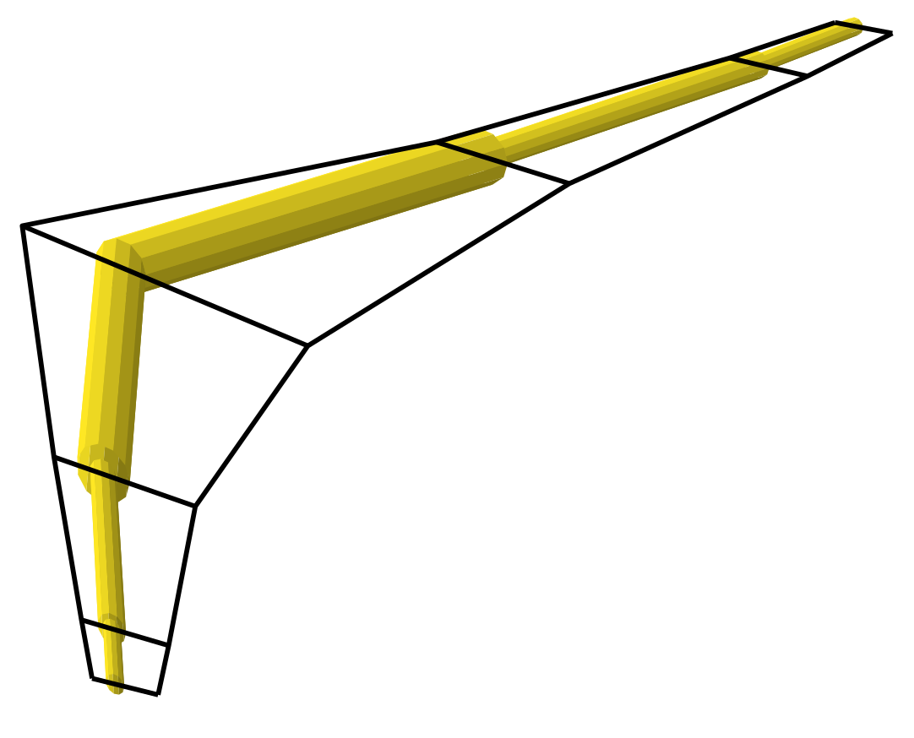

.. _Aerostruct:

Aerostructural Optimization
===========================

The following Python script performs aerostructural optimization to minimize fuel burn while varying twist, thickness, and alpha subject to L=W, structural failure, and structural intersection constraints.

.. code-block:: python

  from __future__ import division, print_function
  from OpenAeroStruct import OASProblem

  # Set problem type
  prob_dict = {'type' : 'aerostruct',
               'optimize' : True}

  # Instantiate problem and add default surface
  OAS_prob = OASProblem(prob_dict)

  # Create a dictionary to store options about the surface
  surf_dict = {'name' : 'wing',
               'symmetry' : True,
               'num_y' : 7,
               'num_x' : 2,
               'wing_type' : 'CRM',
               'CL0' : 0.2,
               'CD0' : 0.015,
               }

  # Add the specified wing surface to the problem
  OAS_prob.add_surface(surf_dict)

  # Add design variables, constraint, and objective on the problem
  OAS_prob.add_design_var('alpha', lower=-10., upper=10.)
  OAS_prob.add_constraint('eq_con', equals=0.)
  OAS_prob.add_objective('fuelburn', scaler=1e-4)

  # Setup problem and add design variables, constraint, and objective
  OAS_prob.add_design_var('wing.twist_cp', lower=-15., upper=15.)
  OAS_prob.add_design_var('wing.thickness_cp', lower=0.001, upper=0.25, scaler=1e2)
  OAS_prob.add_constraint('wing_perf.failure', upper=0.)
  OAS_prob.add_constraint('wing_perf.thickness_intersects', upper=0.)
  OAS_prob.setup()

  # Actually run the problem
  OAS_prob.run()

  print("\nFuelburn:", OAS_prob.prob['fuelburn'])

Which should output the optimization results and then this line:

.. code-block:: console

  Fuelburn: 69790.2241357

We will now go through each block of code to explain what is going on within OpenAeroStruct.

.. code-block:: python

  from __future__ import print_function
  from OpenAeroStruct import OASProblem

We import the OASProblem class from OpenAeroStruct, which is how we access the methods within OpenAeroStruct.
Additionally, we import print_function to ensure compatibility between Python 2 and Python 3.

.. code-block:: python

  # Set problem type
  prob_dict = {'type' : 'aerostruct',
             'optimize' : True}

  # Instantiate problem and add default surface
  OAS_prob = OASProblem(prob_dict)

We then create a dictionary containing options for the problem we want to solve.
We define our problem as aerostructural and specify that we want to perform optimization.
Please see :meth:`OASProblem.get_default_prob_dict` to see the defaults for the problem options dictionary.

.. code-block:: python

  # Create a dictionary to store options about the lifting surface
  surf_dict = {'name' : 'wing',
             'symmetry' : True,
             'num_y' : 7,
             'num_x' : 2,
             'wing_type' : 'CRM',
             'CL0' : 0.2,
             'CD0' : 0.015,
             }

   # Add the specified wing surface to the problem
   OAS_prob.add_surface(surf_dict)

Next, we add a single lifting surface to the problem.
In this case, we provide a name and tell OpenAeroStruct to explicitly model only one half of the surface and compute the effects from the other half of the surface.
This is computationally cheaper than modeling the entire surface.

We then provide the number of spanwise (num_y) and chordwise (num_x) mesh points to use for the surface.
These numbers correspond to the entire surface even though we are using symmetric effects.
So, this wing has 10 spanwise panels and 2 chordwise panels, but we only model 5 spanwise panels and 2 chordwise panels, as shown below.

We set the wing_type as 'CRM' to use the Common Research Model, a B777-sized wing.
We also set the CL0 and CD0, which are values for the rest of the aircraft without the aerodynamic effects from the wing.
These scalars are simply added to the wing CL and CD to get the total coefficients.

.. code-block:: python

  # Add design variables, constraint, and objective for the problem
  OAS_prob.add_design_var('alpha', lower=-10., upper=10.)
  OAS_prob.add_design_var('wing.twist_cp', lower=-15., upper=15.)
  OAS_prob.add_design_var('wing.thickness_cp', lower=0.001, upper=0.25, scaler=1e2)

  OAS_prob.add_constraint('wing_perf.failure', upper=0.)
  OAS_prob.add_constraint('wing_perf.thickness_intersects', upper=0.)
  OAS_prob.add_constraint('eq_con', equals=0.)
  OAS_prob.add_objective('fuelburn', scaler=1e-4)
  OAS_prob.setup()

First we set up the problem using OASProblem's built-in method and add optimization parameters.
We allow the optimizer to vary the angle of attack, alpha, between -10 degrees and 10 degrees.
Then we set the b-spline control points for the twist distribution with bounds at -15 and 15 degrees as design variables.
We also set the thickness control points with a lower bound of 0.001 m and an upper bound of 0.25 m.

Next, we set three constraints.
The first ensures that the wing structure does not exceed its yield limit, while the next ensures that the tubular elements do not self-intersect.
The last constraint is a L=W constraint so the lift generated by the aerodynamics is equal to the total weight of the aircraft.

We're optimizing the fuel burn, which is computed using the calculated values and inputted aircraft parameters using the Breguet range equation.

.. code-block:: python

  # Actually run the problem
  OAS_prob.run()

  print("\nFuelburn:", OAS_prob.prob['fuelburn'])

Lastly, we actually run the optimization and print the resulting fuel burn in kg.

We can then visualize the results by running

.. code-block:: bash

  python plot_all.py aerostruct.db
